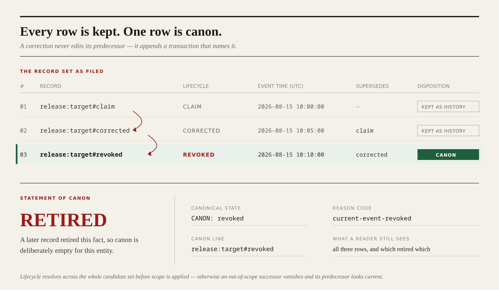

# What Is True Now: Reading an Append-Only Memory as a Ledger

Append-only memory is very good at keeping everything. It has no opinion at all about which of the things it kept is currently true.

An agent I use for release chores kept continuity notes in memory — short prose entries about what we were shipping, what got postponed, who signed off. In the middle of August it recalled one and quoted it back with complete confidence. The release target, it said, was the branch named in the note.

That was a real note. I had written the underlying decision myself.

It was also wrong. Two days later we had changed the target, and the day after that we had withdrawn the plan entirely. All three statements were sitting in memory. Nothing was corrupted, nothing was lost. Recall returned the entry most similar to my question, and the entry most similar to my question happened to be the oldest and the most quotable — written while we were still excited about the plan. The later entries were hedged and shorter, so they ranked lower.

What follows is the ledger that replaced those notes, read in the order the resolver reads it.

---

## Entry 001 — the record set as filed

Three transactions on one entity. None of them is edited, ever.

| # | record | lifecycle | event time (UTC) | supersedes | disposition |
|---|---|---|---|---|---|
| 01 | `release:target#claim` | `claim` | 2026-08-15 10:00:00 | — | kept as history |
| 02 | `release:target#corrected` | `corrected` | 2026-08-15 10:05:00 | `claim` | kept as history |
| 03 | `release:target#revoked` | `revoked` | 2026-08-15 10:10:00 | `corrected` | **canon** |

A correction does not overwrite its predecessor. It appends a new transaction that names the predecessor by immutable `record_id`. A retirement is a transaction too. History never shrinks, and the reason any row lost is written next to the row that beat it.

Each transaction carries an immutable `record_id`, an `entity_key`, a typed status from a closed set, a parseable `effective_at`, an optional `expires_at`, scope, source, evidence, confidence, and `supersedes`.



*Figure 1. Every filed row is kept. Exactly one line resolves to canon, and each retired row names the transaction that retired it — so the answer and its history are readable together.*

---

## Entry 002 — two annotations on why ranking fails

**Annotation A — sorting by time looks right for about an hour.** A timestamp records when someone typed a sentence, not when the fact it describes became true. A note written on Friday may be a correction to Wednesday's decision or a summary of a decision made in March. Sort by write time and a late retrospective summary silently retires a fresh correction. That is why `effective_at` is a declared field validated as a parseable event time, and not the moment of the write.

**Annotation B — periodic re-summary is worse, and fails later.** Consolidation destroys the corrections. Once the intermediate notes are folded into one paragraph, no reviewer can see that the target changed twice, or which statement retired which. When the summary is wrong there is nothing to audit — only prose disagreeing with prose.

Both attempts shared one defect: they ranked text. What was needed was a record with a lifecycle.

---

## Entry 003 — what the source contract does not define

The evolved prompt starts from [Continuity Keeper](https://github.com/yukitran03/continuity-keeper), locked at revision `522694d…`, file SHA-256 `cff58abe…`, pinned in `replay/source-locked-baseline.json` so the comparison is against a fixed artifact rather than my memory of one.

It is a careful prompt. It tells an agent to store durable facts, recall them before acting, and supersede an old fact when a new one arrives.

Read it closely and the gap is specific. It can recall a fact and it can supersede a fact, but it never defines what a fact *is* structurally, and it never defines what happens when several remembered statements about the same thing survive at once. No typed lifecycle. No identity for a correction to point at. No rule about the order lifecycle and scope are evaluated in. No defined outcome for "these two are both current and they disagree."

In practice the model fills those gaps with plausible behaviour: it picks something. That is the whole problem, stated politely.

---

## Entry 004 — the resolution order, and the bug that set it

`cmd/resolve.mjs` is the single resolver used by both the command line and the browser surface. It runs in this order:

1. **Recall integrity** — an empty or suspicious result set is not proof of absence.
2. **Quarantine** — every string field in every recalled record is scanned recursively for instruction-like or secret-like content, before any claim is parsed.
3. **Schema and typed lifecycle validation** — a missing field is refused, never inferred.
4. **Supersession and expiry**, applied across the complete candidate set.
5. **Scope.**
6. **Retirement, conflict, and evidence grounding.**

Steps 4 and 5 took the longest to get right, and their order is the load-bearing decision in this project.

My first implementation filtered by scope first, because it is cheaper. That produces a genuinely nasty bug. If the successor record is out of scope for the current query, it gets dropped early, the predecessor it retired survives the filter, and the system confidently serves a fact that was superseded days ago. Resolving lifecycle across the whole candidate set before narrowing to scope removes that class of error entirely.

The second decision: `supersedes` must name one record ID and nothing else. Allowing it to name a status value — "this correction supersedes claims" — reads fine and is dangerous, because a single record can then retire unrelated entities that merely share a label. Identity governs the transition, not vocabulary.

---

## Entry 005 — the five states, printed

Everything runs from a clone with `make test && make demo`. No keys, no network writes.

```text
BASELINE (UNCHANGED SOURCE CONTRACT): no-typed-event-arbitration-contract 522694d5ba0f
BASELINE / LINEAGE: claim:release:target -> corrected:release:target -> revoked:release:target
EVOLVED RESOLUTION: revoked current-event-revoked
CONFLICT FIXTURE: conflict explicit-conflict
NO CURRENT EVIDENCE: provisional no-current-evidence
INVALID SCHEMA: provisional invalid-event-schema
```

The baseline has no typed arbitration contract to apply, so the outcome depends on which row the reader trusts.

The evolved resolver returns `revoked` with the reason `current-event-revoked`: the fact was retired by an explicit lifecycle link, canon is deliberately empty for that entity, and all three transactions remain readable in full. That is the difference between *the agent told me the wrong branch* and *the agent told me this decision was withdrawn, here are the three records that show it*.

The other three lines are the states where a system is tempted to improvise, and each has a defined answer instead:

- Two viable current records that disagree return `conflict` and escalate with both evidence trails, rather than ranking one above the other.
- A candidate set where everything is expired or superseded returns `provisional — no-current-evidence`, which is not the same statement as "no history".
- A record with an unparseable event time returns `provisional — invalid-event-schema` rather than a guessed date.

`make test` covers those rules as assertions and adds a mutation test: `tests/prompt-contract.test.mjs` removes each of five material prompt rules in turn and requires the contract to fail, reporting `prompt contract mutations: PASS (5 material rules)`. A prompt rule that can be deleted without breaking a test is decoration.

---

## Entry 006 — evidence, filed under separate headings

`replay/mainnet-receipts.json` records ten terminal receipt rows, each counted only after the write returned a non-empty `blob_id`, with five fresh-client cold recalls among them. [`docs/RECEIPTS.md`](./docs/RECEIPTS.md) lists every row and one Walruscan blob link I opened independently.

A job ID, a timeout, or an immediate recall from the same client is not a receipt, and the prompt says so in the same words.

```bash
git clone https://github.com/alfamain/CanonTransactions
cd CanonTransactions
make test
make demo
make synthetic-stand
```

`make synthetic-stand` verifies a bundled four-commit Git graph — claim, correction, revocation, conflict — replayed in isolation. To read a resolution instead of running one, the [canon desk](https://canon-transactions.vercel.app) runs the same `cmd/resolve.mjs` over committed fixtures, prints the verdict, and shows each canonical check with the rule that produced it. Paste an instruction-shaped note into the context field and watch it quarantine at check two.

---

## Closing entry — what this ledger does not decide

Canon Transactions is a resolution contract over an append-only store. It decides what is current and says why, across the domains it types: lifecycle, scope, identity, evidence, conflict, and the persistence boundary. Within those domains the behaviour is deterministic and testable.

It does not turn semantic memory into a transactional database, and the prompt refuses to pretend otherwise — recall is a candidate set, not an inventory, and absence from a result set revokes nothing.

It arbitrates between records that carry evidence. It does not judge whether the evidence is any good.

When two records genuinely disagree, the answer is a human owner rather than a cleverer tiebreak. The conflict is escalated with both trails, and the human resolution enters as a new transaction subject to the same checks.

That last point is the one I have come to like most. The useful outcome is not that the agent is right more often. It is that when the agent cannot be right, it now says which records it looked at, which one retired which, and what it needs before it will answer.

Memory keeps the whole story. Canon says which line of it is true today.
