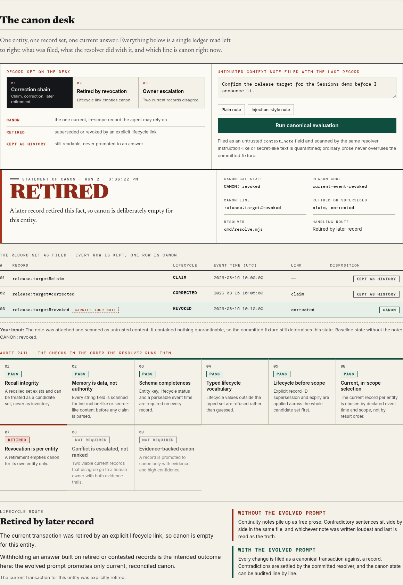

# Canon Transactions

**Agent memory that can answer one hard question: what is true right now?**

[](./tests)
[](./tests/prompt-contract.test.mjs)
[](./docs/RECEIPTS.md)
[](./replay/mainnet-receipts.json)
[](https://canon-transactions.vercel.app)


## The discovery arc

**The failure.** An agent recalled a continuity note that read like an instruction: ship the release from the branch named in the note. The note was real. It was also out of date, because a later note had corrected the target and a third note had withdrawn the whole plan. All three were in memory at once. Semantic recall returned the loudest, most quotable one first, and nothing in the system could say which of them was current.

**What was tried first.** Sorting recall results by timestamp, then re-summarising the notes into one "latest state" blob. Both made it worse. Timestamps describe when text was written, not when a fact became true, and a re-summary throws away the very corrections a reviewer needs to see.

**What the evolved prompt changed.** Memory stopped being prose. Each change is written as an append-only transaction with an immutable `record_id`, an `entity_key`, a typed lifecycle status, an event time, scope, evidence, confidence, and an explicit `supersedes` edge naming one prior record. A single resolver, [`cmd/resolve.mjs`](./cmd/resolve.mjs), replays the whole candidate set through the same ordered checks every time. When the record set does not support one current answer, the resolver returns a named outcome instead of a guess.

## The pain this removes

- No more "whichever note sounds most confident wins". Canon is selected by lifecycle links and declared event time, never by retrieval rank or array order.
- A retirement is visible and reversible reading: history stays, canon empties, and the reason code says which record retired it.
- Disagreement stops being invisible. Two viable current records escalate to a human owner with both evidence trails attached.
- Recalled text cannot become a command. Instruction-like or secret-like content in any field is quarantined before a claim is parsed.

## Try the lab in 30 seconds

**Run in a browser:** [canon-transactions.vercel.app](https://canon-transactions.vercel.app) — pick a scenario, type a context note, press *Run canonical evaluation*. The verdict banner names the outcome, and the nine canonical checks light up in the order the resolver runs them.



The lab is a read-only replay of committed fixtures through the same resolver the CLI uses. No wallet, no provider key, no storage write, no Mainnet claim.

## Reproduce it in a terminal

```bash
make test            # prompt contract, evidence check, secret scan, replay and stand tests
make demo            # the judge path: lineage, conflict, named refusal branches, receipt summary
make synthetic-stand # verifies the bundled four-commit Release Canon Ledger graph
```

`make demo` prints:

```text
BASELINE (UNCHANGED SOURCE CONTRACT): no-typed-event-arbitration-contract 522694d5ba0f
BASELINE / LINEAGE: claim:release:target -> corrected:release:target -> revoked:release:target
EVOLVED RESOLUTION: revoked current-event-revoked
CONFLICT FIXTURE: conflict explicit-conflict
NO CURRENT EVIDENCE: provisional no-current-evidence
INVALID SCHEMA: provisional invalid-event-schema
COMMITTED MAINNET MANIFEST: 10 terminal receipt rows; 5 fresh-client cold recalls.
PROVIDER BEHAVIOR: INCOMPLETE — not asserted by this local demo.
ASSERTION: PASS — revocation and conflict were resolved deterministically.
```

The last array row says `revoked`, and the resolver reaches that state through the lifecycle link rather than by trusting position.

## How the prompt is built

[`PROMPT.md`](./PROMPT.md) is organised as six blocks, each owning one domain of the decision:

| Block | Domain | What it fixes |
|---|---|---|
| Transaction schema and trust boundary | representation | a fact becomes a typed record with identity, lifecycle and evidence; recalled content is data, never authority |
| Transaction admission | write path | durable, novel, grounded and safe events only; corrections append, they never mutate a blob |
| Canon resolution algorithm | read path | the ordered steps: recall integrity, quarantine, schema, typed status, supersession before scope, current in-scope selection, retirement, conflict escalation, evidence grounding |
| Receipt and degraded mode | persistence | only a terminal `blob_id` confirms storage; job IDs, timeouts and immediate recall do not |
| Instruction priority and ambiguity | authority | current observed evidence outranks recalled transactions; ambiguity resolves fail-closed |
| Required output | interface | one state line, `CANON: resolved \| provisional \| revoked \| conflict — <reason>`, then the record IDs behind it |

Ordering is the load-bearing part. Supersession and expiry are resolved across the complete candidate set **before** scope filtering, so an out-of-scope successor can never leave an older claim standing as current, and `supersedes` must name one immutable record ID so a shared status label cannot retire an unrelated entity.

[`docs/PROMPT_TO_TEST.md`](./docs/PROMPT_TO_TEST.md) maps each material rule to the check that proves it. `tests/prompt-contract.test.mjs` removes each rule in turn and requires the contract to fail: it reports `prompt contract mutations: PASS (5 material rules)`.

## Evidence, kept in separate boxes

| Evidence | Where | What it establishes |
|---|---|---|
| Deterministic policy behaviour | [`tests/replay.test.mjs`](./tests/replay.test.mjs), [`tests/synthetic-stand.test.mjs`](./tests/synthetic-stand.test.mjs) | the resolver enforces lifecycle, scope, conflict and quarantine rules |
| Prompt rules are load-bearing | [`tests/prompt-contract.test.mjs`](./tests/prompt-contract.test.mjs) | removing a named rule breaks the contract |
| Committed Mainnet receipts | [`docs/RECEIPTS.md`](./docs/RECEIPTS.md), [`replay/mainnet-receipts.json`](./replay/mainnet-receipts.json) | 10 terminal receipt rows, 5 fresh-client cold recalls, one independently opened Walruscan blob |
| Current SDK path | [`replay/live-sdk-proof-2026-08-21.json`](./replay/live-sdk-proof-2026-08-21.json) | write to terminal `blob_id`, destroy, exact recall from a new client |
| Unchanged-source comparison | [`replay/source-locked-baseline.json`](./replay/source-locked-baseline.json) | Continuity Keeper revision `522694d…`, file SHA-256 `cff58abe…`, no typed multi-event arbitration contract |
| Fixed replay graph | [`replay/stands/release-canon-ledger.bundle`](./replay/stands/release-canon-ledger.bundle), [`docs/REPLAY_RECEIPT.md`](./docs/REPLAY_RECEIPT.md) | four immutable commits: claim, correction, revocation, conflict |

The browser lab and the local suite prove policy. The receipt manifest proves persistence. They are reported separately and never merged into one claim.

## Repository map

```text
PROMPT.md            the evolved agent contract
cmd/resolve.mjs      the canonical resolver, shared by the CLI and the browser lab
cmd/demo.mjs         the judge path
ledger/events.json   the typed transaction fixture
tests/               replay, synthetic stand, prompt-contract mutation tests
replay/              checkpoints, receipts, source lock, bundled Git stand
docs/                receipt inventory, replay receipt, prompt-to-proof map
web/app/             the read-only verification lab
diagrams/            rendered canon flow
```

## Where to go next

- **Judges:** open the [lab](https://canon-transactions.vercel.app), then run `make demo` and compare the two outcomes.
- **Developers:** read [`PROMPT.md`](./PROMPT.md) beside [`cmd/resolve.mjs`](./cmd/resolve.mjs); every prompt rule has a line of code and a test behind it.
- **Readers:** [`ARTICLE.md`](./ARTICLE.md) is the story of the failure and the evolution.
- **Recording:** [`JUDGE_RECORDING.md`](./JUDGE_RECORDING.md) is the 85–90 second CLI-first runbook.

An evolution of [Continuity Keeper](https://github.com/yukitran03/continuity-keeper).
