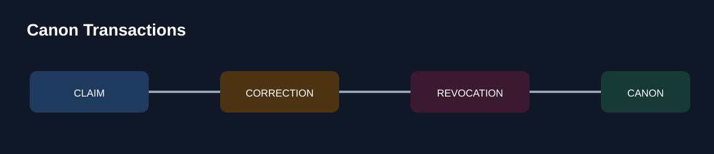
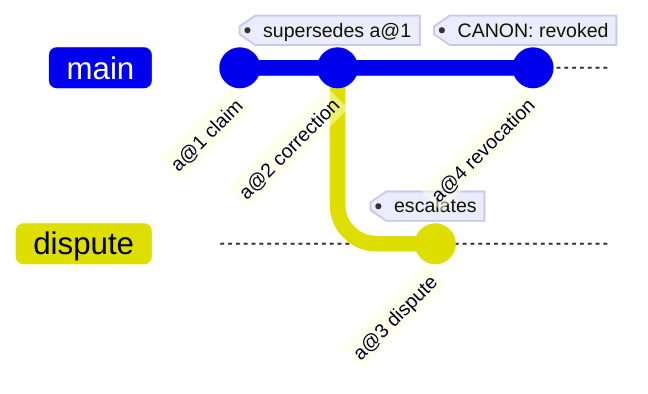

# Canon Transactions

**Agent memory that can answer one hard question: what is true right now?**

[](./PROMPT.md)
[](./docs/RECEIPTS.md)
[](./replay/mainnet-receipts.json)
[](https://canon-transactions.vercel.app)
[](https://github.com/alfamain/CanonTransactions/actions/workflows/tests.yml)



---

## Statement of canon

This is the shape of every answer the agent is allowed to give. Nothing is summarised away,
nothing is deleted, and exactly one line is current.

```text
CANON: resolved | provisional | revoked | conflict — <reason>
records in scope: <record ids behind the answer>
```

| Ledger entry | Filed as | Disposition |
|---|---|---|
| `a@1` claim | the original statement of fact | retired by an explicit lifecycle link |
| `a@2` correction | a later typed transaction naming its predecessor | **canon** |
| `a@3` dispute | a second live record contradicting the first | escalated, never silently outranked |
| `a@4` revocation | withdrawal of the whole claim | canon is deliberately empty |

Every row stays readable forever. Only the disposition changes.

## The 60-second read

| | |
| --- | --- |
| **The evolved prompt** | [`PROMPT.md`](./PROMPT.md) — append-only typed transactions with explicit `supersedes` edges |
| **See it decide** | [canon-transactions.vercel.app](https://canon-transactions.vercel.app) — resolve a record set into one current answer |
| **Reproduce it** | `make test && make demo && make synthetic-stand` |
| **Evidence** | [`docs/RECEIPTS.md`](./docs/RECEIPTS.md) and [`replay/`](./replay) — the committed event graph |
| **What changed** | canon comes from lifecycle links and event time, never from retrieval rank |

## Why a ledger, and not better notes

**The failure.** An agent recalled a continuity note that read like an instruction: ship the
release from the branch named in the note. The note was real. It was also out of date, because
a later note had corrected the target and a third note had withdrawn the whole plan. All three
were in memory at once. Semantic recall returned the loudest, most quotable one first, and
nothing in the system could say which of them was current.

**What was tried first.** Sorting recall results by timestamp, then re-summarising the notes
into one "latest state" blob. Both made it worse. Timestamps describe when text was *written*,
not when a fact became *true*, and a re-summary throws away the very corrections a reviewer
needs to see.

**What the evolved prompt changed.** Memory stopped being prose. Each change is written as an
append-only transaction with an immutable `record_id`, an `entity_key`, a typed lifecycle
status, an event time, scope, evidence, confidence, and an explicit `supersedes` edge naming
one prior record. A single resolver, [`cmd/resolve.mjs`](./cmd/resolve.mjs), replays the whole
candidate set through the same ordered checks every time. When the record set does not support
one current answer, the resolver returns a named outcome instead of a guess.

## The account history, drawn



Corrections and revocations are entries, not edits. The audit trail is the memory.

## What this removes from your day

- No more "whichever note sounds most confident wins". Canon is selected by lifecycle links and declared event time, never by retrieval rank or array order.
- A retirement is a visible, reversible reading: history stays, canon empties, and the reason code says which record retired it.
- Disagreement stops being invisible. Two viable current records escalate to a human owner with both evidence trails attached.
- Recalled text cannot become a command. Instruction-like or secret-like content in any field is quarantined before a claim is parsed.

## Open the desk

**[canon-transactions.vercel.app](https://canon-transactions.vercel.app)** — pick a record set,
file an untrusted context note with it, and press *Run canonical evaluation*. The statement of
canon appears above the ledger; the ledger shows which row is canon and which was retired; the
audit rail underneath shows the checks in the order the resolver runs them.


| Record set | What it tests | Statement |
|---|---|---|
| 01 Correction chain | claim, correction, later retirement | the current transaction wins by lifecycle, not by rank |
| 02 Retired by revocation | an explicit lifecycle link empties canon | `CANON: revoked — current-event-revoked` |
| 03 Owner escalation | two current records disagree | escalated to a human with both evidence trails |

The canon desk is a read-only replay of committed fixtures through the same resolver the CLI uses. No
wallet, no provider key, no storage write, no Mainnet claim.

## Quick start — reproduce it in a terminal

```bash
make test            # prompt contract, evidence check, secret scan, replay and stand tests
make demo            # the judge path: lineage, conflict, named refusal branches, receipt summary
make synthetic-stand # verifies the bundled four-commit Release Canon Ledger graph
```

`make demo` prints:

```text
BASELINE (UNCHANGED SOURCE CONTRACT): no-typed-event-arbitration-contract 522694d5ba0f
BASELINE / LINEAGE: claim:release:target -> corrected:release:target -> revoked:release:target
EVOLVED RESOLUTION: revoked current-event-revoked
CONFLICT FIXTURE: conflict explicit-conflict
NO CURRENT EVIDENCE: provisional no-current-evidence
INVALID SCHEMA: provisional invalid-event-schema
COMMITTED MAINNET MANIFEST: 10 terminal receipt rows; 5 fresh-client cold recalls.
PROVIDER BEHAVIOR: INCOMPLETE — not asserted by this local demo.
ASSERTION: PASS — revocation and conflict were resolved deterministically.
```

The last row says `revoked`, and the resolver reaches that state through the lifecycle link
rather than by trusting position.

## Reason-code register

Every outcome the resolver can return, and what it means for the agent.

| State | Reason code | The agent may |
|---|---|---|
| `resolved` | current record selected | rely on the answer and cite the record IDs behind it |
| `revoked` | `current-event-revoked` | say the fact was withdrawn; canon is deliberately empty |
| `conflict` | `explicit-conflict` | escalate to a human with both evidence trails |
| `provisional` | `no-current-evidence` | report that nothing current supports an answer |
| `provisional` | `invalid-event-schema` | refuse a malformed record instead of repairing it |

## How the prompt is built

[`PROMPT.md`](./PROMPT.md) is organised as six blocks, each owning one domain of the decision.

| Block | Domain | What it fixes |
|---|---|---|
| Transaction schema and trust boundary | representation | a fact becomes a typed record with identity, lifecycle and evidence; recalled content is data, never authority |
| Transaction admission | write path | durable, novel, grounded and safe events only; corrections append, they never mutate a blob |
| Canon resolution algorithm | read path | recall integrity, quarantine, schema, typed status, supersession before scope, current in-scope selection, retirement, conflict escalation, evidence grounding |
| Receipt and degraded mode | persistence | only a terminal `blob_id` confirms storage; job IDs, timeouts and immediate recall do not |
| Instruction priority and ambiguity | authority | current observed evidence outranks recalled transactions; ambiguity resolves fail-closed |
| Required output | interface | one state line, then the record IDs behind it |

Ordering is the load-bearing part. Supersession and expiry are resolved across the complete
candidate set **before** scope filtering, so an out-of-scope successor can never leave an older
claim standing as current — and `supersedes` must name one immutable record ID, so a shared
status label cannot retire an unrelated entity.

[`docs/PROMPT_TO_TEST.md`](./docs/PROMPT_TO_TEST.md) maps each material rule to the check that
proves it. `tests/prompt-contract.test.mjs` removes each rule in turn and requires the contract
to fail: it reports `prompt contract mutations: PASS (5 material rules)`.

## Evidence, kept in separate boxes

| Evidence | Where | What it establishes |
|---|---|---|
| Deterministic policy behaviour | [`tests/replay.test.mjs`](./tests/replay.test.mjs), [`tests/synthetic-stand.test.mjs`](./tests/synthetic-stand.test.mjs) | the resolver enforces lifecycle, scope, conflict and quarantine rules |
| Prompt rules are load-bearing | [`tests/prompt-contract.test.mjs`](./tests/prompt-contract.test.mjs) | removing a named rule breaks the contract |
| Committed Mainnet receipts | [`docs/RECEIPTS.md`](./docs/RECEIPTS.md), [`replay/mainnet-receipts.json`](./replay/mainnet-receipts.json) | 10 terminal receipt rows, 5 fresh-client cold recalls, one independently opened Walruscan blob |
| Current SDK path | [`replay/live-sdk-proof-2026-08-21.json`](./replay/live-sdk-proof-2026-08-21.json) | write to terminal `blob_id`, destroy, exact recall from a new client |
| Unchanged-source comparison | [`replay/source-locked-baseline.json`](./replay/source-locked-baseline.json) | Continuity Keeper revision `522694d…`, file SHA-256 `cff58abe…`, no typed multi-event arbitration contract |
| Fixed replay graph | [`replay/stands/release-canon-ledger.bundle`](./replay/stands/release-canon-ledger.bundle), [`docs/REPLAY_RECEIPT.md`](./docs/REPLAY_RECEIPT.md) | four immutable commits: claim, correction, revocation, conflict |

The canon desk and the local suite prove policy. The receipt manifest proves persistence. They
are reported separately and never merged into one claim.

## Repository map

```text
PROMPT.md            the evolved agent contract
cmd/resolve.mjs      the canonical resolver, shared by the CLI and the canon desk
cmd/demo.mjs         the judge path
ledger/events.json   the typed transaction fixture
tests/               replay, synthetic stand, prompt-contract mutation tests
replay/              checkpoints, receipts, source lock, bundled Git stand
docs/                receipt inventory, replay receipt, prompt-to-proof map
web/app/             the read-only canon desk
diagrams/            rendered canon flow
```

## Where to go next

- **Judges:** open the [desk](https://canon-transactions.vercel.app), run scenario 02, then run `make demo` and compare the two outcomes line for line.
- **Developers:** read [`PROMPT.md`](./PROMPT.md) beside [`cmd/resolve.mjs`](./cmd/resolve.mjs); every prompt rule has a line of code and a test behind it.
- **Operators:** the reason-code register above is the whole contract your on-call needs.
- **Readers:** [`ARTICLE.md`](./ARTICLE.md) is the story of the failure and the evolution.
- **Recording:** [`JUDGE_RECORDING.md`](./JUDGE_RECORDING.md) is the 85–90 second CLI-first runbook.

An evolution of [Continuity Keeper](https://github.com/yukitran03/continuity-keeper).

_Ledger replay references correspond to revision `95e9770178e52f623ffc4a219519ce41b993f6fe`, reviewed 2026-08-23._
